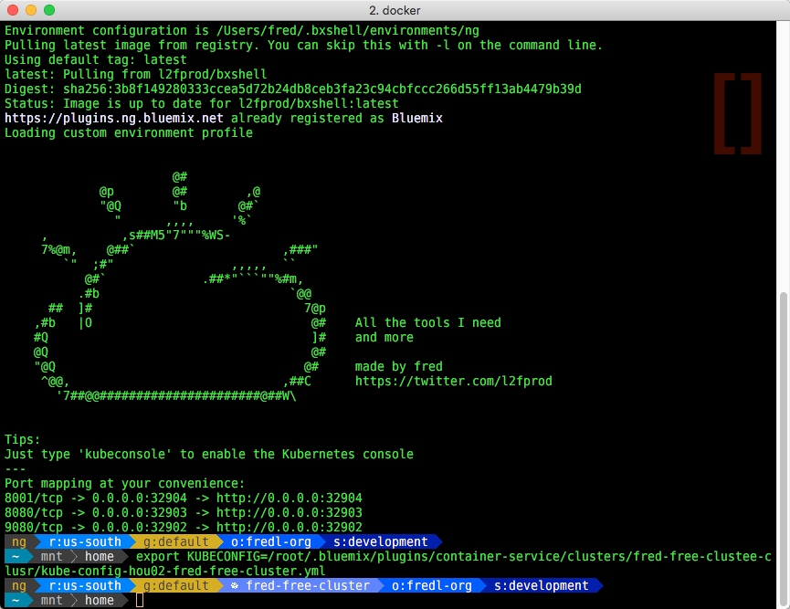

# bxshell - All the Bluemix tools I need in one Docker image and a few shell scripts

**bxshell** has one Docker image where the Bluemix CLI and its plugin have been preinstalled together with the CLI to work with containers. It also provides a script to start the Docker image and to mount configuration directories into the image.

---

Use `bxenv.sh <env_name>` to start a new shell on the environment `env_name`. Environment name is arbitrary. You can use any name. This is only a way to keep configuration files together.

`bxenv.sh` calls `bxshell.sh` which in turn runs the Docker container interactively. The container will die when you quit the shell.

On your host, **bxshell** stores configuration files under `$HOME/.bxshell` where it creates one subfolder per environment. Under these folders, you'll find several configuration files created by the Docker container as you use the various Bluemix CLI and other scripts there.

Under $HOME/.bxshell/<env_name> you can create a .env_profile file to perform additional initialization when bxshell starts.

`bxshell.sh` starts the Docker container with privileged mode and expose the local Docker socket inside the container so you can build images there too.

